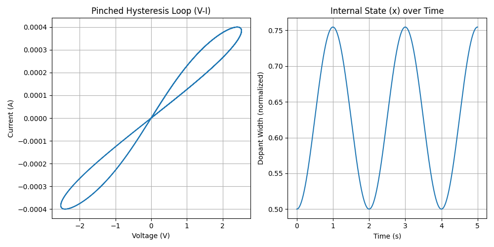
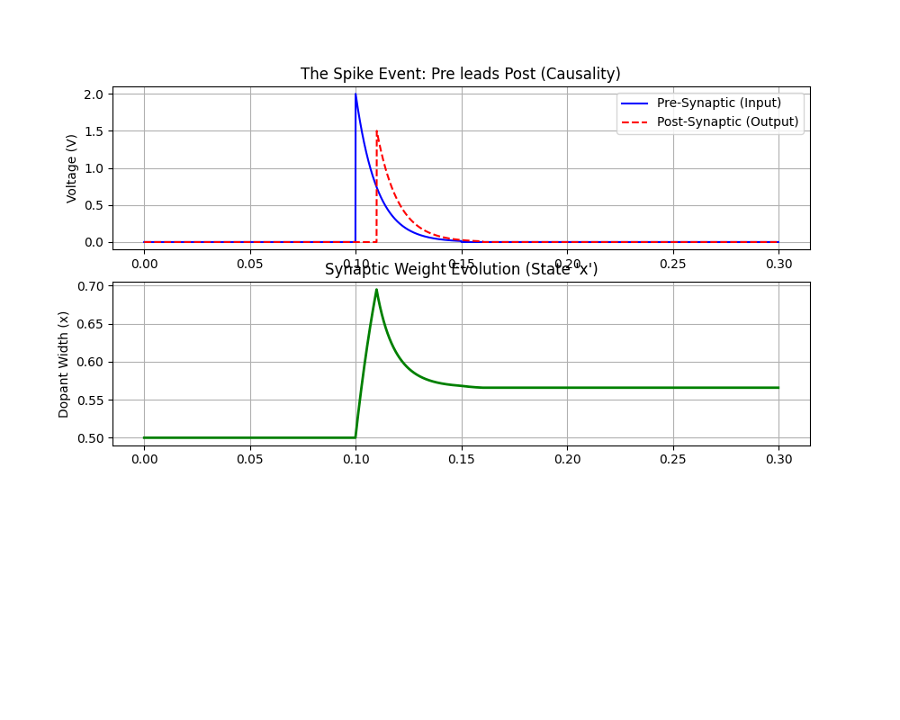

# Memristor Simulations

A collection of simulations exploring memristor behavior and applications in neuromorphic computing.

## 🧠 The Physics (Strukov Model)

The device is modeled as a TiO₂ thin film with oxygen vacancies drifting under an electric field:

**Voltage-current relationship:**
$$v(t) = \left( R_{on} \cdot x(t) + R_{off} \cdot (1 - x(t)) \right) \cdot i(t)$$

**State evolution:**
$$\frac{dx}{dt} = k \cdot i(t) \cdot f(x)$$

Where:
- `x(t)` is the normalized state variable ($0 \le x \le 1$) representing the doped region width
- `R_on` is the resistance when fully doped
- `R_off` is the resistance when undoped
- `k` is the drift velocity coefficient
- `f(x)` is a window function preventing state saturation
- `i(t)` is the applied current
- `v(t)` is the resulting voltage

The window function typically takes the form:
$$f(x) = 1 - (2x - 1)^{2p}$$
where `p` controls the nonlinearity (higher p → sharper boundaries).

## 🔬 Project Overview

This hardware-aware simulation explores Memristive Nanodevices and their application in Neuromorphic Computing. The project models the nonlinear dopant drift kinetics (Strukov model) and demonstrates biological learning via Spike-Timing-Dependent Plasticity (STDP).

**Phase 1: Device Physics** Simulation of the HP TiO₂ Memristor model, demonstrating the signature "Pinched Hysteresis Loop."

**Phase 2: Synaptic Plasticity** Implementation of a memristive synapse connecting Pre- and Post-synaptic neurons.  
* **Key Finding:** Demonstrated that symmetric square-wave spikes fail to induce Long-Term Potentiation (LTP). Implemented exponential decay (shark-fin) spikes and amplitude asymmetry to achieve stable synaptic weight updates.

**Phase 3: System-Level Simulation (MNIST)** Scaling from single devices to a full Neural Network. This phase replaces standard PyTorch linear layers with a custom `MemristiveLinear` layer that simulates the non-idealities of analog crossbar arrays.

**Phase 3.5: Robustness & Write Noise** A stress test of the AI model against permanent hardware damage (Conductance Variability), proving the inherent robustness of neural networks to analog errors.

## 📊 Results

### 1. The Pinched Hysteresis (Phase 1)
Evidence of the memristor's non-volatile memory property.  


### 2. STDP Learning Window (Phase 2)
Demonstration of Long-Term Potentiation (LTP) where the synaptic weight (`x`) increases and stabilizes due to causal spiking.  


### 3. System-Level Inference (Phase 3)
To simulate a real memristor chip, we cannot use perfect floating-point weights. I implemented a custom "Hardware-Aware" layer that introduces **Static Write Noise**.

**The Mechanism:**
Unlike "Read Noise" (which fluctuates every millisecond), **Write Noise** represents programming errors. If a memristor is programmed incorrectly, it stays incorrect forever.
1.  **Train:** The model is trained in software (Ideal FP32).
2.  **Program:** We simulate writing these weights to the chip.
3.  **Damage:** Static noise is injected once: $W_{chip} = W_{ideal} + \mathcal{N}(0, \sigma)$.
4.  **Inference:** The model runs using these permanently "damaged" weights.

### 4. Robustness Analysis (Phase 3.5)
I performed a noise sweep from 0% to 60% variance to determine the "breaking point" of the hardware.

**Key Finding:**
The network demonstrated extreme resilience. Even with **60% noise** (massive hardware failure), the accuracy only dropped by ~4%. This suggests that analog AI chips **do not need expensive, high-precision components** to be effective.

| Hardware Noise Level ($\sigma$) | Accuracy | Drop from Baseline |
| :--- | :--- | :--- |
| **0% (Ideal Software)** | **94.32%** | - |
| **10%** | **94.26%** | -0.06% |
| **20%** | **93.61%** | -0.71% |
| **30%** | **93.54%** | -0.78% |
| **40%** | **91.37%** | -2.95% |
| **50%** | **89.48%** | -4.84% |
| **60% (Extreme Failure)** | **80.26%** | -14.06% |


## 🛠 Usage

### Installation
```bash
pip install torch torchvision numpy matplotlib scipy
```

### Running the Experiments

**1. Device Physics & STDP Simulations (Phase 1 & 2)**
Simulate the single memristor behavior and synaptic learning rules.
```bash
python examples/plot_hysteresis.py 
python examples/plot_stdp.py
```

**2. System-Level Test (Phase 3)**
Run the MNIST classifier with a specific noise level.
```bash
python train_mnist.py
```

**3. Robustness Sweep (Phase 3.5)**
Run the full stress test from 0% to 60% noise variance.
```bash
python noise_sweep.py
```

## 🧩 Implementation Details

### The "Write Noise" Injection
To simulate permanent hardware damage, we freeze the noise mask during the first forward pass. This ensures that a specific weight remains "broken" in the same way for the entire inference lifetime.

```python
# Code snippet from MemristiveLinear layer
# Proportional Noise Injection (Write Noise)
self.static_noise = torch.randn_like(self.weight) * self.noise_scale * torch.abs(self.weight)
noisy_weight = self.weight + self.static_noise
```
